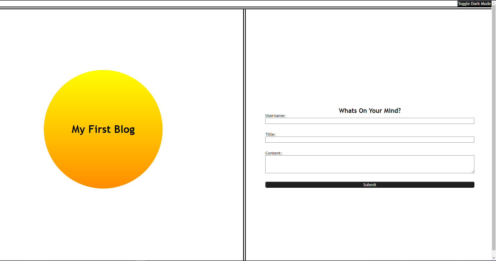
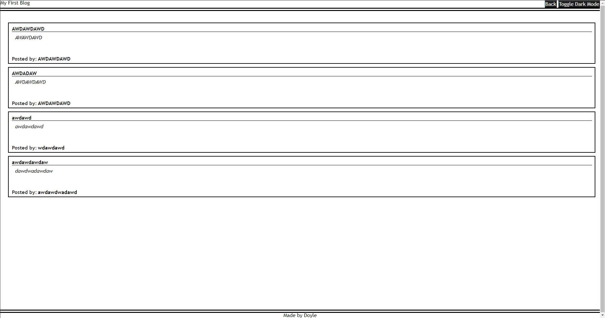

# Personal-Blog
Personal blog for Module 4 challenge

The purpose of this challenge was to create a Blog webpage that dynamically creates list elements, saves input to local storage, and display the posts in a blog format.

As we've progressed through these challenges, i have noticed that my knowledge and understanding of the content has improved. I find it much easier to understand where a problem is yet still struggle to figure out the 'why'. 

For example, I couldnt figure out why the list elements werent being created and why the local storage was being overwritten when it clearly saved the previous array entry. It took several hours for me to understand, but i eventually realized that my problem wasnt where the elements were being created; It was that my array variales were set as 'const' instead of 'let' which prevented several functions form running properly.

All in all, (looking back on it) this challenge was pretty straight forward, i just failed to recognize several errors in my code for several hours.

---Reset-CSS------------------------------------------------------
---Source: CWRU-VIRT-FSF-PT-02-2024-U-LOLC/ 02-Advanced-CSS/ 01-Activities/ 12-Stu_CSS-Resets/ Solved/ assets/ css/ reset.css---
I decided to take the reset css from the module 2 challenge which is originally from our course materials.
------------------------------------------------------------------

---Dark-Mode-JS---------------------------------------------------
---Source: https://www.w3schools.com/howto/howto_js_toggle_dark_mode.asp---
I used the example provided by w3schools to toggle dark mode on both pages.
------------------------------------------------------------------

---Link-to-Deployed-Application-----------------------------------
https://johntd796.github.io/Personal-Blog/

------------------------------------------------------------------

MIT License

Copyright (c) 2024 JohnTD796

Permission is hereby granted, free of charge, to any person obtaining a copy of this software and associated documentation files (the "Software"), to deal in the Software without restriction, including without limitation the rights to use, copy, modify, merge, publish, distribute, sublicense, and/or sell copies of the Software, and to permit persons to whom the Software is furnished to do so, subject to the following conditions:

The above copyright notice and this permission notice shall be included in all copies or substantial portions of the Software.

THE SOFTWARE IS PROVIDED "AS IS", WITHOUT WARRANTY OF ANY KIND, EXPRESS OR IMPLIED, INCLUDING BUT NOT LIMITED TO THE WARRANTIES OF MERCHANTABILITY, FITNESS FOR A PARTICULAR PURPOSE AND NONINFRINGEMENT. IN NO EVENT SHALL THE AUTHORS OR COPYRIGHT HOLDERS BE LIABLE FOR ANY CLAIM, DAMAGES OR OTHER LIABILITY, WHETHER IN AN ACTION OF CONTRACT, TORT OR OTHERWISE, ARISING FROM, OUT OF OR IN CONNECTION WITH THE SOFTWARE OR THE USE OR OTHER DEALINGS IN THE SOFTWARE.